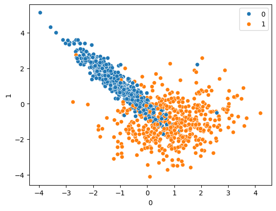

# SVC Classification with Kernels & Hyperparameter Tuning

A quick, hands-on notebook exploring Support Vector Classifiers (SVC) on a synthetic 2-feature, binary-class dataset. It compares the four kernels and then tunes the best one with `GridSearchCV`.



## What's inside

1. **Data**: 1000 samples from `make_classification` (2 features, 2 classes, 1 cluster per class), visualized with a seaborn scatter plot.
2. **Split**: 75% train / 25% test (`random_state=10`).
3. **Kernel comparison**: linear, RBF, polynomial, sigmoid.
4. **Tuning**: `GridSearchCV` (5-fold CV) over `C` and `gamma` for the RBF kernel.
5. **Evaluation**: classification report + confusion matrix for every model.

## Results (test set, 250 samples)

| Model | Accuracy |
|---|---|
| Linear | 0.89 |
| RBF (default) | 0.92 |
| Polynomial | 0.85 |
| Sigmoid | 0.85 |
| RBF + GridSearchCV (`C=1, gamma=1`) | 0.92 |

> `make_classification` is called without a `random_state`, so your numbers will differ slightly from run to run. Add `random_state=<int>` for reproducible results.

## Setup

```bash
git clone https://github.com/Aditya-hope/SVC-kernel-showdown.git
cd <SVC-kernel-showdown>

python -m venv venv
source venv/bin/activate        # Windows: venv\Scripts\activate

pip install -r requirements.txt
jupyter notebook svc.ipynb
```

## Tech stack

Python, scikit-learn, pandas, NumPy, seaborn, matplotlib, Jupyter

## Possible next steps

- Plot decision boundaries for each kernel
- Add feature scaling with a `Pipeline`
- Try `RandomizedSearchCV` or a wider grid (including `poly` degree)
- Test on a real dataset

## License

MIT, see [LICENSE](LICENSE).